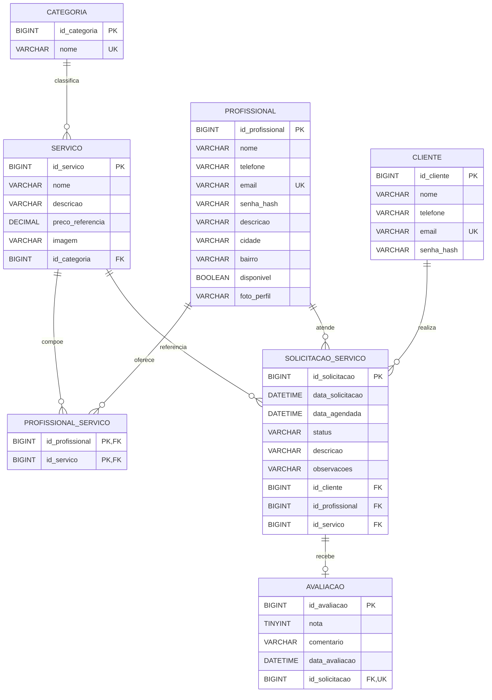

# Modelo de dados do Precisei

Este documento registra a modelagem conceitual e lógica aprovada para o Módulo 3 do Precisei.

O modelo representa a evolução do banco de dados. Sua estrutura física foi criada na migração Flyway V1; no código Java, somente a entidade `Categoria` está mapeada nesta etapa. As demais entidades serão adicionadas incrementalmente nas próximas etapas.

## Objetivo da modelagem

O banco deve permitir que:

- categorias classifiquem os serviços disponíveis;
- profissionais ofereçam um ou mais serviços;
- clientes solicitem um serviço a um profissional;
- solicitações possuam data, descrição e status;
- serviços concluídos possam receber uma avaliação;
- relacionamentos e restrições preservem a integridade dos dados.

## Diagrama entidade-relacionamento

## Entidades

### Categoria

Representa uma classificação ampla de serviços, como Elétrica, Hidráulica, Faxina e Chaveiro. Uma categoria pode classificar vários serviços.

### Serviço

Representa uma atividade específica que pode ser contratada. Exemplos: instalação de tomada, troca de fechadura e montagem de guarda-roupa. Cada serviço pertence obrigatoriamente a uma categoria.

### Profissional

Representa o prestador autônomo. Contém dados de identificação, contato, apresentação, localização e disponibilidade.

### ProfissionalServiço

Entidade associativa que implementa a relação muitos para muitos entre profissionais e serviços. A chave primária composta impede que o mesmo serviço seja associado duas vezes ao mesmo profissional.

### Cliente

Representa a pessoa que solicita um atendimento. Possui identificação e dados de contato próprios.

### Solicitação de serviço

Registra o pedido realizado por um cliente para que um profissional execute um serviço. Centraliza datas, descrição, observações e estado do atendimento.

### Avaliação

Registra a nota e o comentário referentes a uma solicitação concluída. Uma solicitação pode possuir no máximo uma avaliação.

## Relacionamentos e cardinalidades

| Entidade de origem | Cardinalidade | Entidade de destino | Regra |
|---|---:|---|---|
| Categoria | 1:N | Serviço | Uma categoria classifica nenhum ou vários serviços; cada serviço possui uma categoria. |
| Profissional | N:N | Serviço | Um profissional oferece vários serviços e um serviço pode ser oferecido por vários profissionais. |
| Cliente | 1:N | Solicitação de serviço | Um cliente pode realizar várias solicitações; cada solicitação pertence a um cliente. |
| Profissional | 1:N | Solicitação de serviço | Um profissional pode atender várias solicitações; cada solicitação indica um profissional. |
| Serviço | 1:N | Solicitação de serviço | Um serviço pode constar em várias solicitações; cada solicitação indica um serviço. |
| Solicitação de serviço | 1:0..1 | Avaliação | Uma solicitação pode não possuir avaliação ou possuir exatamente uma. |

## Decisões de modelagem

### Categoria como entidade independente

A categoria não será armazenada como texto repetido em cada serviço. A chave estrangeira `id_categoria` evita duplicidade e mantém a nomenclatura centralizada.

### Serviços oferecidos por profissionais

A relação entre profissional e serviço é muitos para muitos. Ela será representada por `profissionais_servicos`, sem repetir colunas de serviço dentro de `profissionais`.

### Avaliação vinculada à solicitação

A avaliação referencia somente a solicitação. Cliente, profissional e serviço podem ser encontrados por meio dessa relação, evitando chaves estrangeiras redundantes na tabela de avaliações.

### Média calculada

A média de avaliações não será armazenada em `profissionais`. Ela será calculada com `AVG(nota)` para não ficar divergente das avaliações registradas.

### Senhas

Os campos de autenticação representam hashes de senha, nunca senhas em texto puro. A autenticação será implementada em uma etapa posterior.

### Localização

Nesta versão, a localização será representada por cidade e bairro. Geolocalização por coordenadas ou cálculo de distância permanece fora do escopo do Módulo 3.

## Estados da solicitação

Os estados permitidos serão:

| Estado | Significado |
|---|---|
| `PENDENTE` | Solicitação criada e ainda não aceita. |
| `ACEITA` | Solicitação aceita pelo profissional. |
| `EM_ANDAMENTO` | Serviço em execução. |
| `CONCLUIDA` | Atendimento finalizado. |
| `CANCELADA` | Solicitação encerrada sem conclusão do serviço. |

## Ordem de implementação

1. Categoria, já existente;
2. Serviço;
3. Profissional;
4. ProfissionalServiço;
5. Cliente;
6. Solicitação de serviço;
7. Avaliação.

Essa ordem reduz dependências incompletas e permite testar cada relacionamento antes de avançar.
