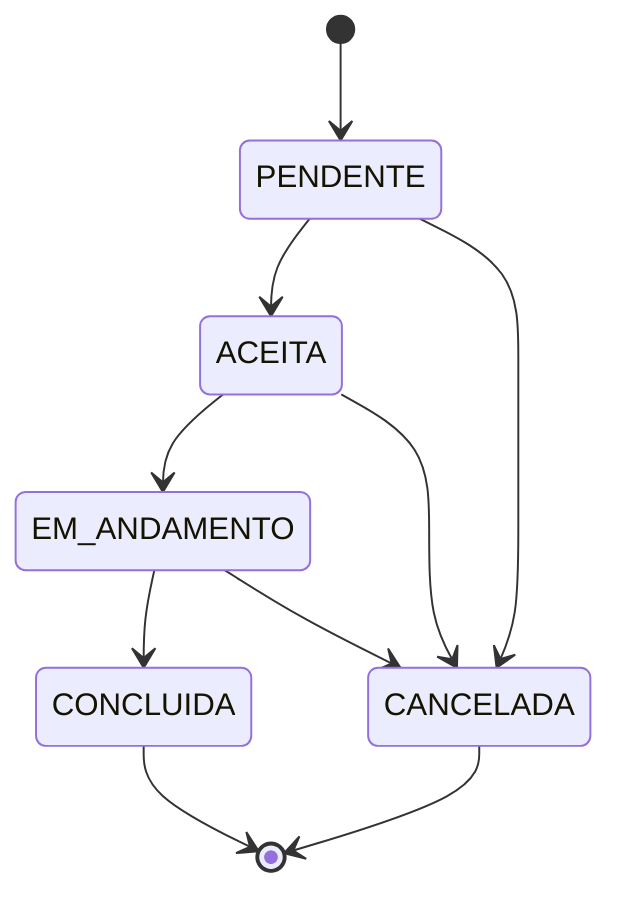

# Regras de integridade e negócio

As regras abaixo orientam tanto o esquema SQL quanto as futuras validações no Spring. Elas separam o que deve ser garantido diretamente pelo banco do que depende do fluxo da aplicação.

## Regras garantidas pelo banco

### Identidade e unicidade

- todas as entidades principais possuem chave primária numérica com incremento automático;
- nomes de categorias são únicos;
- um serviço não pode repetir o mesmo nome dentro da mesma categoria;
- e-mails de clientes são únicos;
- e-mails de profissionais são únicos;
- a mesma combinação profissional-serviço não pode ser duplicada;
- uma solicitação pode possuir no máximo uma avaliação.

### Obrigatoriedade

- serviços sempre possuem categoria;
- solicitações sempre possuem cliente, profissional e serviço;
- avaliações sempre possuem uma solicitação;
- campos essenciais de identificação não aceitam valor nulo;
- disponibilidade e status sempre possuem valor definido.

### Domínio dos valores

- preços de referência não podem ser negativos;
- notas devem estar entre 1 e 5;
- status deve pertencer ao conjunto definido;
- quando informada, a data agendada não pode ser anterior à data de criação da solicitação.

### Integridade referencial

- categorias utilizadas por serviços não podem ser excluídas;
- clientes, profissionais e serviços relacionados a solicitações não podem ser excluídos;
- associações da tabela `profissionais_servicos` podem ser removidas em cascata quando o registro principal puder ser excluído;
- uma avaliação pode ser removida em cascata junto à solicitação, caso a remoção desta seja permitida.

## Regras garantidas pela aplicação

- textos recebidos pelos formulários serão normalizados antes da persistência;
- e-mails serão validados antes do cadastro;
- senhas serão transformadas em hash antes de serem armazenadas;
- um profissional só poderá receber solicitação de um serviço que oferece;
- somente solicitações concluídas poderão ser avaliadas;
- mudanças de status deverão respeitar o fluxo permitido;
- mensagens de validação deverão ser compreensíveis na interface.

## Fluxo planejado de status

Não será permitido retornar uma solicitação concluída ou cancelada para um estado anterior.

## Regras de exclusão para demonstração do CRUD

O Módulo 3 deve demonstrar operações `DELETE`, mas a exclusão será executada somente em registros sem dependências ou em dados especificamente criados para os testes.

Exemplos seguros:

- excluir uma associação profissional-serviço;
- excluir uma avaliação de teste;
- excluir um serviço que não possua profissionais nem solicitações;
- excluir um cliente sem solicitações.

Esse cuidado permite demonstrar manipulação de dados sem enfraquecer as chaves estrangeiras.

## Normalização adotada

O modelo busca atender até a terceira forma normal:

1. os atributos são atômicos e não existem grupos repetidos;
2. os atributos dependem da chave completa de cada tabela;
3. dados derivados ou pertencentes a outras entidades não são duplicados.

Por isso:

- categoria não é repetida como texto em serviço;
- serviços de profissionais ficam em uma tabela associativa;
- cliente e profissional não são repetidos em avaliação;
- média de avaliação é calculada por consulta.

